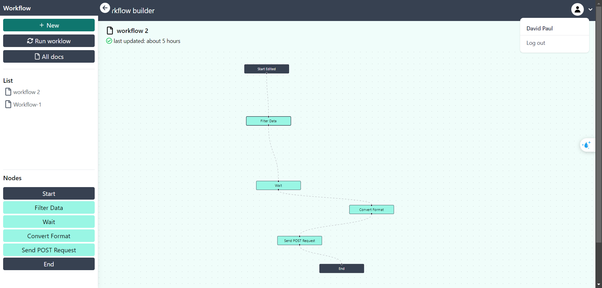

# Workflow App in MERN with Tailwind, Reactflow, Zustand and Tanstack Query


**How it works**

- Allows users to create workflows for basic data manipulation tasks. Users will visually construct workflows using pre-defined nodes available via a drag-and-drop interface.
- Then in another page they can upload data & select the workflow to trigger the execution

**Here, we have 4 predefined nodes that tend to execute the workflow based on the data from the uploaded `.csv` file**

- Filter Data: 
    This node converts all data within a specified column to lowercase.
- Wait: 
    This node introduces a 60-second delay in the workflow execution.
- Convert Format: 
    This node transforms data from CSV format to JSON.
- Send POST Request: 
    This node transmits a POST request containing a JSON payload to the URL (https://requestcatcher.com).


**Features**

- Workflow including (nodes, edges),
- User Authtentication & Authorization ,
- Added Nodes by Drag & Drop,
- Copy and Delete Nodes, 
- Save and Loaded workflow
- Execute the workflow after uploading `.csv` file data

*To start application: You have to install first NodeJS from here [NodeJS download](https://nodejs.org/en/download/prebuilt-installer) in your system and after installation follow these steps as below*

1. Clone this repo by the command 

```bash
git clone -b dev https://github.com/anishVermaIsHere/workflow.git
```
2. Create `.env` file in `client` folder.

```bash
VITE_BASE_URL='http://localhost:5000'

```
3. And also create another `.env` file into `api` folder.

```bash
SERVER_PORT=5000
CORS_ORIGIN='http://localhost:5173' or <YOUR_DOMAIN>
DB_URI=<YOUR_DATABASE_URI>
REQUEST_CATCHER_URL=<YOUR_REQUEST_URL>

SALT=10
ACCESS_TOKEN_SEC_KEY=<YOUR_KEY>
REFRESH_TOKEN_SEC_KEY=<YOUR_KEY>
ACCESS_TOKEN_EXPIRY='1h'
REFRESH_TOKEN_EXPIRY='7d'

```

4. Then enter to `client` directory and run command 

```bash 
npm i
``` 
after installation of all dependencies, start the app within same directory with command 

```bash
npm run dev
```

5. And similarly install all dependencies for `api` as well, and then start the app with command 

```bash
npm start
```
6. Your app will run successfully.


 **Screenshot**

 [screen recording](https://www.loom.com/share/62f1a3ee581c4c96b15fc8221c0c21ba?sid=6c07f7b0-c4c7-46a6-acac-64e3ec3b7227) 

 

 
 
 


 
